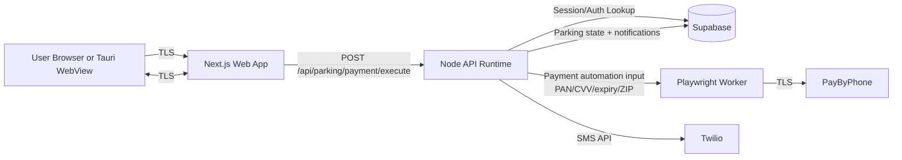

# ParkOS CDE Data Flow (PCI DSS SAQ D)

## Scope Notes
- Cardholder data entry happens in merchant-controlled UI (`PaymentConfirmForm`), then is sent to merchant API before processor submission.
- Stored account profile and parking-session data are persisted in Supabase.
- Saved local payment profile data is encrypted at rest on device and unlocked once per session.

## In-Scope Components
- Web client payment and account components.
- Next.js API routes handling login, profile, and payment execution.
- Playwright automation runtime and container image.
- Supabase tables containing account/session/notification data.
- CI/CD workflows producing deployable artifacts.
